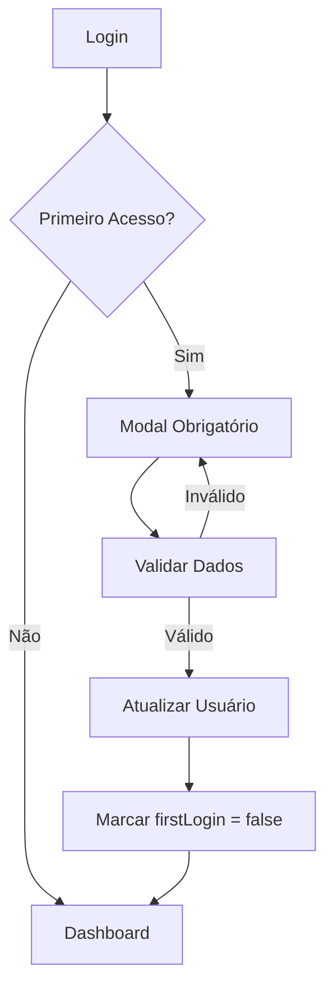
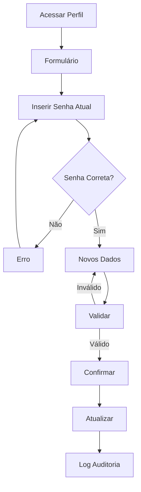

# 🔐 Arquitetura - Sistema de Alteração de Credenciais

## 📋 Visão Geral

Este documento define a arquitetura para implementar a funcionalidade de alteração de login e senha após o primeiro acesso no Sistema de Consulta Fiscal.

## 🏗️ Estrutura de Dados

### 1. Estrutura de Usuário Expandida

```javascript
const userStructure = {
    username: 'string',           // Login atual
    password: 'string',           // Senha atual (hash)
    role: 'admin|user',          // Papel do usuário
    name: 'string',              // Nome completo
    email: 'string',             // Email (opcional)
    firstLogin: 'boolean',       // Indica se é primeiro acesso
    lastPasswordChange: 'date',  // Data da última alteração
    passwordHistory: ['string'], // Histórico de senhas (hash)
    accountLocked: 'boolean',    // Conta bloqueada
    failedAttempts: 'number',    // Tentativas de login falhadas
    createdAt: 'date',          // Data de criação
    updatedAt: 'date'           // Última atualização
};
```

### 2. Estrutura de Validação de Senhas

```javascript
const passwordRules = {
    minLength: 8,
    maxLength: 50,
    requireUppercase: true,
    requireLowercase: true,
    requireNumbers: true,
    requireSpecialChars: true,
    preventReuse: 5,            // Últimas 5 senhas não podem ser reutilizadas
    maxAge: 90,                 // Senha expira em 90 dias (opcional)
    specialChars: '!@#$%^&*()_+-=[]{}|;:,.<>?'
};
```

### 3. Estrutura de Auditoria

```javascript
const auditLog = {
    userId: 'string',
    action: 'string',           // 'password_change', 'username_change', 'login_attempt'
    timestamp: 'date',
    ipAddress: 'string',        // IP do usuário (se disponível)
    userAgent: 'string',        // Navegador/dispositivo
    success: 'boolean',         // Se a ação foi bem-sucedida
    details: 'object'           // Detalhes adicionais
};
```

## 🔧 Componentes da Arquitetura

### 1. Gerenciador de Usuários (UserManager)

```javascript
class UserManager {
    // Métodos principais
    validatePassword(password, rules)
    hashPassword(password)
    comparePassword(password, hash)
    updateUserCredentials(userId, newData)
    checkPasswordHistory(userId, newPassword)
    lockAccount(userId)
    unlockAccount(userId)
    logAuditEvent(userId, action, details)
}
```

### 2. Validador de Credenciais (CredentialValidator)

```javascript
class CredentialValidator {
    validateUsername(username)
    validatePassword(password)
    validateEmail(email)
    checkUsernameAvailability(username, currentUserId)
    generatePasswordStrengthScore(password)
    validatePasswordComplexity(password)
}
```

### 3. Componente de Interface (ProfileManager)

```javascript
function ProfileManager({ user, onUpdate, onCancel }) {
    // Estados para formulário de alteração
    // Validações em tempo real
    // Confirmação de alterações
    // Feedback visual
}
```

## 🎨 Interface de Usuário

### 1. Modal de Primeiro Acesso

- **Trigger**: Exibido quando `user.firstLogin === true`
- **Campos**:
  - Novo nome de usuário (opcional)
  - Nova senha (obrigatório)
  - Confirmação de senha
  - Email (opcional)
- **Validações em tempo real**
- **Não pode ser fechado sem completar**

### 2. Página de Perfil do Usuário

- **Acesso**: Menu do usuário > "Meu Perfil"
- **Seções**:
  - Informações básicas
  - Alteração de credenciais
  - Histórico de alterações
  - Configurações de segurança

### 3. Formulário de Alteração de Credenciais

```jsx
<form>
  <section className="basic-info">
    <input type="text" placeholder="Nome completo" />
    <input type="email" placeholder="Email (opcional)" />
  </section>
  
  <section className="credentials">
    <input type="text" placeholder="Novo nome de usuário" />
    <input type="password" placeholder="Senha atual" />
    <input type="password" placeholder="Nova senha" />
    <input type="password" placeholder="Confirmar nova senha" />
  </section>
  
  <section className="password-strength">
    <PasswordStrengthIndicator password={newPassword} />
  </section>
  
  <section className="actions">
    <button type="submit">Salvar Alterações</button>
    <button type="button">Cancelar</button>
  </section>
</form>
```

## 🔒 Regras de Segurança

### 1. Validação de Senha

- **Comprimento**: 8-50 caracteres
- **Complexidade**: Maiúscula, minúscula, número, caractere especial
- **Histórico**: Não reutilizar últimas 5 senhas
- **Força**: Score mínimo de 3/5

### 2. Validação de Nome de Usuário

- **Comprimento**: 3-20 caracteres
- **Caracteres**: Letras, números, underscore, hífen
- **Unicidade**: Não pode existir outro usuário com mesmo username
- **Reservados**: Lista de usernames proibidos

### 3. Controle de Tentativas

- **Máximo**: 5 tentativas de alteração por hora
- **Bloqueio**: Conta bloqueada após 5 tentativas falhadas
- **Desbloqueio**: Automático após 30 minutos ou manual pelo admin

## 📊 Fluxo de Alteração

### 1. Primeiro Acesso



### 2. Alteração Voluntária



## 🗄️ Armazenamento

### 1. LocalStorage Expandido

```javascript
// Estrutura atual expandida
const storageStructure = {
    // Existentes
    isAuthenticated: 'boolean',
    currentUser: 'object',
    darkMode: 'boolean',
    appStatistics: 'object',
    
    // Novos
    userProfiles: 'object',     // Perfis completos dos usuários
    auditLog: 'array',          // Log de auditoria
    securitySettings: 'object'  // Configurações de segurança
};
```

### 2. Migração de Dados

```javascript
// Função para migrar usuários existentes
function migrateExistingUsers() {
    const currentUsers = [
        { username: 'admin', password: '123456', role: 'admin', name: 'Administrador' },
        { username: 'user', password: '123', role: 'user', name: 'Usuário' },
        { username: 'consultor', password: '456', role: 'user', name: 'Consultor' }
    ];
    
    return currentUsers.map(user => ({
        ...user,
        firstLogin: true,
        lastPasswordChange: new Date().toISOString(),
        passwordHistory: [hashPassword(user.password)],
        accountLocked: false,
        failedAttempts: 0,
        createdAt: new Date().toISOString(),
        updatedAt: new Date().toISOString()
    }));
}
```

## 🎯 Casos de Uso

### 1. Primeiro Acesso do Usuário

**Cenário**: Usuário faz login pela primeira vez
**Ação**: Sistema força alteração de credenciais
**Resultado**: Usuário define suas próprias credenciais

### 2. Alteração Voluntária

**Cenário**: Usuário quer alterar suas credenciais
**Ação**: Acessa perfil e altera dados
**Resultado**: Credenciais atualizadas com sucesso

### 3. Recuperação de Conta

**Cenário**: Usuário esqueceu a senha
**Ação**: Admin pode resetar e forçar nova alteração
**Resultado**: Usuário recebe acesso temporário

## 🔍 Validações e Feedback

### 1. Feedback Visual

- **Força da senha**: Barra de progresso colorida
- **Disponibilidade do username**: Ícone verde/vermelho
- **Erros de validação**: Mensagens específicas
- **Sucesso**: Notificação de confirmação

### 2. Mensagens de Erro

```javascript
const errorMessages = {
    passwordTooShort: 'A senha deve ter pelo menos 8 caracteres',
    passwordTooWeak: 'A senha deve conter maiúscula, minúscula, número e caractere especial',
    passwordReused: 'Esta senha foi usada recentemente. Escolha uma diferente',
    usernameExists: 'Este nome de usuário já está em uso',
    usernameInvalid: 'Nome de usuário deve ter 3-20 caracteres alfanuméricos',
    currentPasswordWrong: 'Senha atual incorreta',
    passwordMismatch: 'As senhas não coincidem'
};
```

## 🚀 Implementação

### Fase 1: Estrutura Base
- [ ] Expandir estrutura de usuários
- [ ] Criar validadores de credenciais
- [ ] Implementar sistema de hash de senhas

### Fase 2: Interface
- [ ] Modal de primeiro acesso
- [ ] Página de perfil do usuário
- [ ] Formulário de alteração

### Fase 3: Segurança
- [ ] Sistema de auditoria
- [ ] Controle de tentativas
- [ ] Validações avançadas

### Fase 4: Testes
- [ ] Testes de validação
- [ ] Testes de segurança
- [ ] Testes de interface

---

**Arquiteto**: Winston (BMad Orchestrator)
**Data**: Janeiro 2025
**Status**: Pronto para desenvolvimento

> 🎯 **Próximo Passo**: Acionar agente James para implementação do desenvolvimento