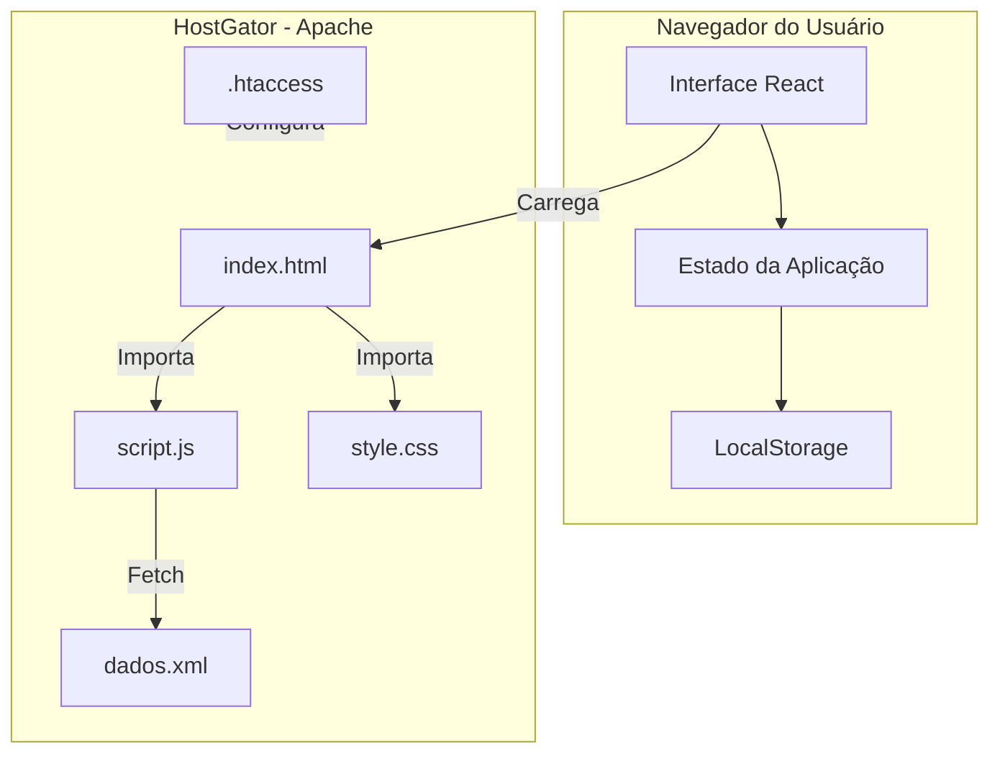
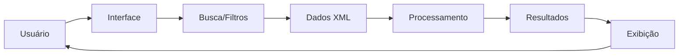

# 📊 Análise da Aplicação - Sistema de Consulta Fiscal

## 1. Visão Geral

### 1.1 Identificação
- **Nome**: Sistema de Consulta Fiscal (CNAE x LIST LC 116/03)
- **Tipo**: Single Page Application (SPA)
- **Autor**: Murilo Miguel
- **Ano**: 2025

### 1.2 Propósito
Sistema web para consulta de códigos CNAE (Classificação Nacional de Atividades Econômicas) e sua relação com itens da LIST LC 116/03 (Lei Complementar 116/2003) para determinação de alíquotas de ISS (Imposto Sobre Serviços).

---

## 2. Arquitetura Técnica

### 2.1 Stack Tecnológica

| Camada | Tecnologia |
|--------|------------|
| Frontend | HTML5, CSS3, JavaScript (ES6+) |
| Framework CSS | Tailwind CSS via CDN |
| Framework JS | React 18 via CDN (Babel standalone) |
| Dados | XML estático (dados.xml) |
| Hospedagem | HostGator (Apache) |

### 2.2 Estrutura de Arquivos

```
Consult_ISS_ItemXCNAE/
├── .htaccess                           # Configuração Apache
├── index.html                          # Página principal SPA
├── script.js                           # Lógica React da aplicação
├── style.css                           # Estilos customizados
├── dados.xml                           # Base de dados CNAE/LIST LC
├── Sand.gif                            # Asset visual (loading)
├── README.md                           # Documentação principal
├── dados.md                            # Dados estruturados
├── ARQUITETURA_ALTERACAO_CREDENCIAIS.md # Arquitetura de segurança
├── DEPLOY_HOSTGATOR.md                 # Guia de deploy
├── DEPLOY_RAPIDO.txt                   # Resumo rápido de deploy
└── test.html                           # Arquivo de testes
```

### 2.3 Diagrama de Arquitetura



---

## 3. Componentes da Aplicação

### 3.1 Módulos Principais (script.js)

| Componente | Função |
|------------|--------|
| `App` | Componente raiz, gerencia estado global |
| `LoginScreen` | Autenticação de usuários |
| `Dashboard` | Painel principal após login |
| `SearchBar` | Barra de busca com filtros |
| `ResultsTable` | Tabela de resultados |
| `ItemCard` | Card individual de item |
| `AdvancedFilters` | Filtros avançados de busca |
| `Statistics` | Estatísticas de uso |
| `UserProfile` | Perfil do usuário |

### 3.2 Fluxo de Dados



---

## 4. Funcionalidades

### 4.1 Core Features
- ✅ **Busca Universal**: Pesquisa em todos os campos
- ✅ **Busca Avançada**: Filtros específicos por campo
- ✅ **Modo Escuro/Claro**: Alternância de tema
- ✅ **Autenticação**: Sistema de login com usuários
- ✅ **Responsividade**: Adaptável a mobile/tablet/desktop

### 4.2 Funcionalidades Planejadas
- 🔄 **Alteração de Credenciais**: Sistema completo de gestão de senhas
- 🔄 **Auditoria**: Log de ações dos usuários
- 🔄 **Força de Senha**: Validação avançada de senhas

---

## 5. Sistema de Autenticação

### 5.1 Usuários Padrão

| Username | Senha | Role |
|----------|-------|------|
| admin | 123456 | Administrador |
| user | 123 | Usuário |
| consultor | 456 | Usuário |

### 5.2 Estrutura de Autenticação

```javascript
// Estado de autenticação
const authState = {
    isAuthenticated: false,
    currentUser: null,
    users: [
        { username: 'admin', password: '123456', role: 'admin', name: 'Administrador' },
        { username: 'user', password: '123', role: 'user', name: 'Usuário' },
        { username: 'consultor', password: '456', role: 'user', name: 'Consultor' }
    ]
};
```

### 5.3 Armazenamento Local

```javascript
// LocalStorage keys
const storageKeys = {
    isAuthenticated: 'isAuthenticated',
    currentUser: 'currentUser',
    darkMode: 'darkMode',
    appStatistics: 'appStatistics'
};
```

---

## 6. Base de Dados (dados.xml)

### 6.1 Estrutura XML

```xml
<itens>
    <item>
        <item_lista>...</item_lista>
        <descricao>...</descricao>
        <aliquota>...</aliquota>
        <cnaes>
            <cnae>...</cnae>
        </cnaes>
    </item>
</itens>
```

### 6.2 Campos Disponíveis

| Campo | Descrição |
|-------|-----------|
| `item_lista` | Código do item na LIST LC 116/03 |
| `descricao` | Descrição do serviço |
| `aliquota` | Alíquota de ISS aplicável |
| `cnae` | Código CNAE relacionado |

---

## 7. Segurança

### 7.1 Medidas Implementadas
- Autenticação básica com usuários
- Sessão armazenada no LocalStorage
- Proteção de rotas (requer login)

### 7.2 Vulnerabilidades Identificadas

| Vulnerabilidade | Severidade | Descrição |
|-----------------|------------|-----------|
| Senhas em texto plano | 🔴 Alta | Senhas armazenadas sem hash |
| LocalStorage exposto | 🟡 Média | Dados sensíveis no cliente |
| Sem criptografia | 🟡 Média | Comunicação sem HTTPS obrigatório |
| Usuários hardcoded | 🟡 Média | Credenciais fixas no código |

### 7.3 Recomendações de Segurança

1. **Implementar hash de senhas** (bcrypt, PBKDF2)
2. **Migrar autenticação para backend** com JWT
3. **Forçar HTTPS** via .htaccess
4. **Implementar rate limiting** para tentativas de login
5. **Adicionar CSRF tokens** para ações sensíveis

---

## 8. Performance

### 8.1 Otimizações Implementadas
- ✅ Compressão GZIP via .htaccess
- ✅ Cache de arquivos estáticos
- ✅ Carregamento via CDN (React, Tailwind)
- ✅ Lazy loading de dados XML

### 8.2 Métricas Estimadas

| Métrica | Valor |
|---------|-------|
| Tamanho HTML | ~15 KB |
| Tamanho JS | ~50 KB |
| Tamanho CSS | ~10 KB |
| Tamanho XML | Variável |
| Tempo de carregamento | < 2s |

---

## 9. Deploy

### 9.1 Ambiente de Produção
- **Servidor**: HostGator (Apache)
- **Diretório**: `public_html/`
- **URL**: Configurada no domínio do cliente

### 9.2 Configuração Apache (.htaccess)

```apache
# Compressão GZIP
<IfModule mod_deflate.c>
    AddOutputFilterByType DEFLATE text/html text/css application/javascript application/xml
</IfModule>

# Cache
<IfModule mod_expires.c>
    ExpiresActive On
    ExpiresByType text/css "access plus 1 month"
    ExpiresByType application/javascript "access plus 1 month"
</IfModule>

# SPA Routing
RewriteEngine On
RewriteCond %{REQUEST_FILENAME} !-f
RewriteCond %{REQUEST_FILENAME} !-d
RewriteRule ^ index.html [L]
```

---

## 10. Manutenibilidade

### 10.1 Pontos Fortes
- ✅ Código modular com componentes React
- ✅ Documentação extensa (README, arquitetura)
- ✅ Separação de responsabilidades
- ✅ Padrões de código consistentes

### 10.2 Pontos de Melhoria
- 🔄 Adicionar testes automatizados
- 🔄 Implementar CI/CD
- 🔄 Migrar para build system (Vite/Webpack)
- 🔄 Adicionar TypeScript para type safety

---

## 11. Roadmap Sugerido

### Fase 1: Segurança (Prioridade Alta)
- [ ] Implementar hash de senhas
- [ ] Sistema de alteração de credenciais
- [ ] Forçar HTTPS em produção
- [ ] Log de auditoria

### Fase 2: Backend (Prioridade Média)
- [ ] Criar API REST/Node.js
- [ ] Migrar autenticação para JWT
- [ ] Banco de dados (PostgreSQL/MySQL)
- [ ] Migrar dados XML para banco

### Fase 3: Modernização (Prioridade Baixa)
- [ ] Setup com Vite + React
- [ ] Adicionar TypeScript
- [ ] Testes automatizados (Jest, Cypress)
- [ ] CI/CD com GitHub Actions

---

## 12. Conclusão

### 12.1 Avaliação Geral

| Aspecto | Nota | Comentário |
|---------|------|------------|
| Funcionalidade | ⭐⭐⭐⭐ | Cumpre o propósito adequadamente |
| Usabilidade | ⭐⭐⭐⭐⭐ | Interface intuitiva e responsiva |
| Segurança | ⭐⭐ | Necessita melhorias urgentes |
| Performance | ⭐⭐⭐⭐ | Boa para o escopo atual |
| Manutenibilidade | ⭐⭐⭐⭐ | Bem documentado e organizado |
| Escalabilidade | ⭐⭐⭐ | Limitada pela arquitetura serverless |

### 12.2 Sumário Executivo

A aplicação é um **sistema de consulta fiscal bem estruturado** que atende seu objetivo principal de relacionar códigos CNAE com itens da LIST LC 116/03. A interface é moderna, responsiva e fácil de usar.

**Principais pontos de atenção:**
1. **Segurança** é o aspecto mais crítico - senhas em texto plano e autenticação client-side
2. **Arquitetura** é adequada para pequeno/médio porte, mas pode limitar escalabilidade
3. **Documentação** é excelente, facilitando manutenção e evolução

**Recomendação:** Priorizar implementação das melhorias de segurança antes de expandir para produção com usuários reais.

---

*Análise realizada em Fevereiro de 2025*
*Arquiteto: Kilo Code*
