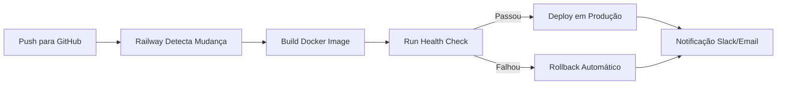

# 🚀 Deploy no Railway - Sistema de Consulta Fiscal

## 📋 Visão Geral

Este documento descreve como migrar a aplicação de LocalStorage para uma arquitetura com backend e banco de dados, permitindo deploy automático no Railway.

---

## 🔄 Comparação de Arquiteturas

### Arquitetura Atual (HostGator)

```
┌─────────────────────────────────────────────────────┐
│                    NAVEGADOR                         │
│  ┌──────────┐  ┌──────────┐  ┌──────────────────┐  │
│  │ React    │  │ Tailwind │  │ LocalStorage     │  │
│  │ (SPA)    │  │ (CSS)    │  │ (Dados isolados) │  │
│  └──────────┘  └──────────┘  └──────────────────┘  │
└─────────────────────────────────────────────────────┘
                         │
                    Arquivos Estáticos
                    (HTML/CSS/JS/XML)
                         │
                    ┌────▼────┐
                    │ HostGator│
                    │ (Apache) │
                    └──────────┘

❌ Problema: Dados isolados por navegador/máquina
```

### Arquitetura Recomendada (Railway)

```
┌─────────────────────────────────────────────────────┐
│                    NAVEGADOR                         │
│  ┌──────────┐  ┌──────────┐  ┌──────────────────┐  │
│  │ React    │  │ Tailwind │  │ JWT Token        │  │
│  │ (SPA)    │  │ (CSS)    │  │ (Autenticação)   │  │
│  └──────────┘  └──────────┘  └──────────────────┘  │
└─────────────────────────────────────────────────────┘
                         │
                    HTTPS/API Calls
                         │
┌────────────────────────▼────────────────────────────┐
│                  RAILWAY                             │
│  ┌──────────────────────────────────────────────┐  │
│  │           API Node.js/Express                 │  │
│  │  • Autenticação JWT                           │  │
│  │  • CRUD Usuários                              │  │
│  │  • Consultas CNAE                             │  │
│  │  • Estatísticas                               │  │
│  └──────────────────────────────────────────────┘  │
│                         │                           │
│  ┌──────────────────────────────────────────────┐  │
│  │           PostgreSQL                          │  │
│  │  • Tabela: users                              │  │
│  │  • Tabela: cnae_data                          │  │
│  │  • Tabela: audit_log                          │  │
│  │  • Tabela: statistics                         │  │
│  └──────────────────────────────────────────────┘  │
└─────────────────────────────────────────────────────┘

✅ Vantagem: Dados centralizados e sincronizados
```

---

## 📁 Estrutura de Arquivos Necessária

```
consult-iss-railway/
├── backend/
│   ├── src/
│   │   ├── index.js              # Entry point
│   │   ├── routes/
│   │   │   ├── auth.js           # Rotas de autenticação
│   │   │   ├── users.js          # CRUD de usuários
│   │   │   ├── cnae.js           # Consultas CNAE
│   │   │   └── stats.js          # Estatísticas
│   │   ├── middleware/
│   │   │   └── auth.js           # Middleware JWT
│   │   ├── models/
│   │   │   ├── User.js           # Modelo de usuário
│   │   │   ├── CnaeData.js       # Modelo de dados CNAE
│   │   │   └── AuditLog.js       # Log de auditoria
│   │   ├── config/
│   │   │   └── database.js       # Configuração PostgreSQL
│   │   └── utils/
│   │       └── crypto.js         # Hash de senhas
│   ├── package.json
│   ├── Dockerfile
│   └── .env.example
│
├── frontend/
│   ├── index.html
│   ├── script.js                 # Adaptado para consumir API
│   ├── style.css
│   └── dados.md
│
├── railway.json                  # Configuração Railway
├── railway.toml                  # Configuração alternativa
└── README.md
```

---

## 🛠️ Passo a Passo para Deploy

### 1. Preparar o Backend (Node.js/Express)

#### `backend/package.json`
```json
{
  "name": "consult-iss-api",
  "version": "1.0.0",
  "main": "src/index.js",
  "scripts": {
    "start": "node src/index.js",
    "dev": "nodemon src/index.js",
    "migrate": "node src/config/migrate.js"
  },
  "dependencies": {
    "express": "^4.18.2",
    "cors": "^2.8.5",
    "bcryptjs": "^2.4.3",
    "jsonwebtoken": "^9.0.0",
    "pg": "^8.11.0",
    "dotenv": "^16.1.4"
  },
  "devDependencies": {
    "nodemon": "^2.0.22"
  },
  "engines": {
    "node": ">=18.0.0"
  }
}
```

#### `backend/src/index.js`
```javascript
const express = require('express');
const cors = require('cors');
const dotenv = require('dotenv');

dotenv.config();

const app = express();

// Middleware
app.use(cors());
app.use(express.json());

// Rotas
app.use('/api/auth', require('./routes/auth'));
app.use('/api/users', require('./routes/users'));
app.use('/api/cnae', require('./routes/cnae'));
app.use('/api/stats', require('./routes/stats'));

// Health check
app.get('/health', (req, res) => {
  res.json({ status: 'ok', timestamp: new Date().toISOString() });
});

// Iniciar servidor
const PORT = process.env.PORT || 3000;
app.listen(PORT, () => {
  console.log(`🚀 Servidor rodando na porta ${PORT}`);
});
```

#### `backend/Dockerfile`
```dockerfile
FROM node:18-alpine

WORKDIR /app

COPY package*.json ./
RUN npm ci --only=production

COPY src ./src

EXPOSE ${PORT:-3000}

CMD ["npm", "start"]
```

---

### 2. Configurar Banco de Dados (PostgreSQL)

#### `backend/src/config/database.js`
```javascript
const { Pool } = require('pg');

const pool = new Pool({
  connectionString: process.env.DATABASE_URL,
  ssl: process.env.NODE_ENV === 'production' 
    ? { rejectUnauthorized: false } 
    : false
});

module.exports = pool;
```

#### Script de Migração (`backend/src/config/migrate.js`)
```javascript
const pool = require('./database');

async function migrate() {
  const client = await pool.connect();
  
  try {
    await client.query(`
      -- Tabela de usuários
      CREATE TABLE IF NOT EXISTS users (
        id SERIAL PRIMARY KEY,
        username VARCHAR(50) UNIQUE NOT NULL,
        password VARCHAR(255) NOT NULL,
        name VARCHAR(100) NOT NULL,
        email VARCHAR(100),
        role VARCHAR(20) DEFAULT 'user',
        first_login BOOLEAN DEFAULT true,
        is_authorized BOOLEAN DEFAULT false,
        is_blocked BOOLEAN DEFAULT false,
        failed_attempts INTEGER DEFAULT 0,
        locked_until TIMESTAMP,
        password_history TEXT[],
        created_at TIMESTAMP DEFAULT CURRENT_TIMESTAMP,
        updated_at TIMESTAMP DEFAULT CURRENT_TIMESTAMP
      );

      -- Tabela de dados CNAE
      CREATE TABLE IF NOT EXISTS cnae_data (
        id SERIAL PRIMARY KEY,
        list_lc VARCHAR(20) NOT NULL,
        description TEXT,
        cnae VARCHAR(50),
        cnae_description TEXT,
        aliquota VARCHAR(10)
      );

      -- Tabela de auditoria
      CREATE TABLE IF NOT EXISTS audit_log (
        id SERIAL PRIMARY KEY,
        user_id INTEGER REFERENCES users(id),
        action VARCHAR(50) NOT NULL,
        details JSONB,
        ip_address VARCHAR(45),
        user_agent TEXT,
        created_at TIMESTAMP DEFAULT CURRENT_TIMESTAMP
      );

      -- Tabela de estatísticas
      CREATE TABLE IF NOT EXISTS statistics (
        id SERIAL PRIMARY KEY,
        user_id INTEGER REFERENCES users(id),
        action_type VARCHAR(50) NOT NULL,
        details JSONB,
        created_at TIMESTAMP DEFAULT CURRENT_TIMESTAMP
      );

      -- Inserir usuários padrão
      INSERT INTO users (username, password, name, role, first_login, is_authorized)
      VALUES 
        ('admin', '$2a$10$...', 'Administrador', 'admin', true, true),
        ('user', '$2a$10$...', 'Usuário', 'user', true, true),
        ('consultor', '$2a$10$...', 'Consultor', 'user', true, true)
      ON CONFLICT (username) DO NOTHING;
    `);
    
    console.log('✅ Migração concluída com sucesso!');
  } catch (error) {
    console.error('❌ Erro na migração:', error);
  } finally {
    client.release();
    pool.end();
  }
}

migrate();
```

---

### 3. Configurar Railway

#### `railway.json`
```json
{
  "$schema": "https://railway.app/railway.schema.json",
  "build": {
    "builder": "DOCKERFILE",
    "dockerfilePath": "backend/Dockerfile"
  },
  "deploy": {
    "startCommand": "npm start",
    "healthcheckPath": "/health",
    "healthcheckTimeout": 100,
    "restartPolicyType": "ON_FAILURE",
    "restartPolicyMaxRetries": 10
  }
}
```

#### `railway.toml` (Alternativa)
```toml
[build]
builder = "DOCKERFILE"
dockerfilePath = "backend/Dockerfile"

[deploy]
startCommand = "npm start"
healthcheckPath = "/health"
healthcheckTimeout = 100
restartPolicyType = "ON_FAILURE"
restartPolicyMaxRetries = 10
```

---

### 4. Variáveis de Ambiente no Railway

Configure no Dashboard do Railway:

| Variável | Descrição | Exemplo |
|----------|-----------|---------|
| `DATABASE_URL` | String de conexão PostgreSQL | (Automático via addon) |
| `JWT_SECRET` | Chave secreta para tokens | `sua-chave-secreta-super-segura` |
| `NODE_ENV` | Ambiente de execução | `production` |
| `PORT` | Porta do servidor | (Automático) |
| `FRONTEND_URL` | URL do frontend para CORS | `https://seu-app.railway.app` |

---

### 5. Deploy Automático via GitHub

#### Passos no Railway Dashboard:

1. **Conectar GitHub**
   - Acesse [railway.app](https://railway.app)
   - Clique em "New Project"
   - Selecione "Deploy from GitHub repo"
   - Autorize acesso ao repositório

2. **Configurar Serviços**
   ```
   ┌─────────────────────────────────────────┐
   │           RAILWAY PROJECT               │
   │                                         │
   │  ┌─────────────┐    ┌───────────────┐  │
   │  │ API Service │    │ PostgreSQL    │  │
   │  │ (Node.js)   │───▶│ (Addon)       │  │
   │  │             │    │               │  │
   │  │ Port: 3000  │    │ Auto-connect  │  │
   │  └─────────────┘    └───────────────┘  │
   │                                         │
   │  Deploy: Automático a cada push         │
   └─────────────────────────────────────────┘
   ```

3. **Configurar Deploy Automático**
   - Settings → GitHub
   - Branch: `main`
   - Check "Auto Deploy"

---

## 🔄 Adaptar Frontend para Consumir API

### Modificações necessárias em `script.js`:

```javascript
// Substituir LocalStorage por chamadas API

// ANTES (LocalStorage)
const users = JSON.parse(localStorage.getItem('userProfiles'));

// DEPOIS (API)
const API_URL = process.env.REACT_APP_API_URL || 'https://seu-app.railway.app/api';

async function getUsers() {
  const response = await fetch(`${API_URL}/users`, {
    headers: {
      'Authorization': `Bearer ${localStorage.getItem('token')}`
    }
  });
  return response.json();
}

// Login
async function handleLogin(username, password) {
  const response = await fetch(`${API_URL}/auth/login`, {
    method: 'POST',
    headers: { 'Content-Type': 'application/json' },
    body: JSON.stringify({ username, password })
  });
  
  const data = await response.json();
  
  if (data.token) {
    localStorage.setItem('token', data.token);
    localStorage.setItem('currentUser', JSON.stringify(data.user));
    return data.user;
  }
  
  throw new Error(data.error);
}
```

---

## 📊 Fluxo de Deploy Automático



---

## ✅ Checklist de Deploy

- [ ] Criar conta no Railway
- [ ] Conectar repositório GitHub
- [ ] Provisionar PostgreSQL
- [ ] Configurar variáveis de ambiente
- [ ] Executar migrações do banco
- [ ] Testar endpoints da API
- [ ] Adaptar frontend para consumir API
- [ ] Configurar domínio customizado (opcional)
- [ ] Habilitar HTTPS (automático no Railway)
- [ ] Configurar monitoramento e logs

---

## 💰 Custos Estimados (Railway)

| Recurso | Plano Free | Plano Pro ($20/mês) |
|---------|------------|---------------------|
| Horas de execução | 500h/mês | Ilimitado |
| Memória RAM | 512MB | Até 8GB |
| PostgreSQL | 1GB | 10GB |
| Bandwidth | 1GB | 100GB |

**Recomendação**: Para produção, o plano Pro é recomendado para melhor performance.

---

## 🔗 Links Úteis

- [Documentação Railway](https://docs.railway.app/)
- [Railway + GitHub Integration](https://docs.railway.app/deployment/github)
- [PostgreSQL no Railway](https://docs.railway.app/databases/postgresql)
- [Variáveis de Ambiente](https://docs.railway.app/develop/variables)

---

**Documento criado em**: Fevereiro 2025
**Autor**: Kilo Code
**Status**: Pronto para implementação
